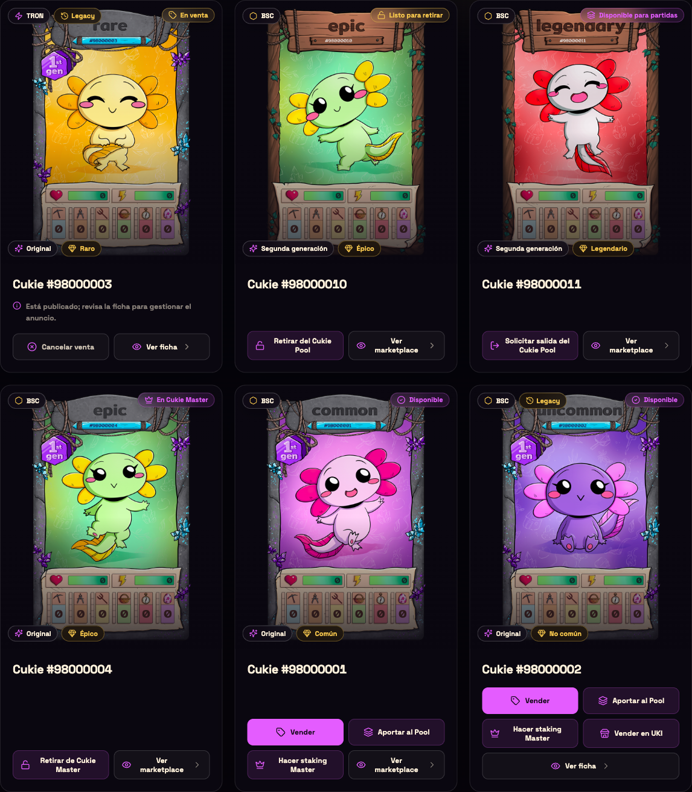
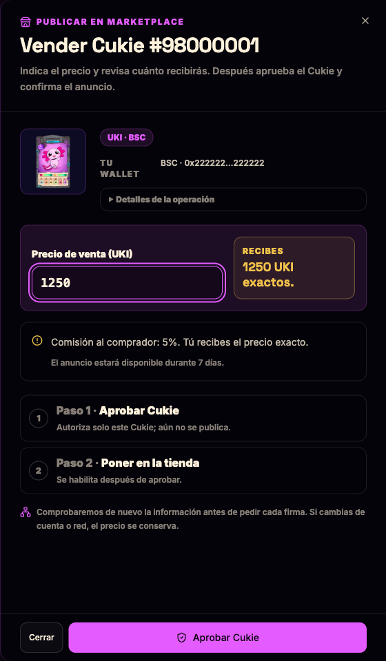
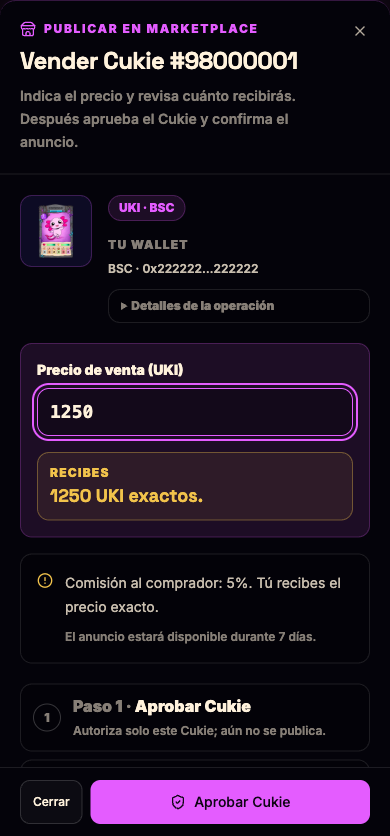

# Cards y sheet de venta — QA local, 10 septiembre 2026

Vista de los componentes reales de la rama, con NFT/estado de wallet simulados y firmas desactivadas. No es evidencia de una compraventa on-chain ni de un despliegue.

- Cards: red, Legacy, estado, generación y rareza sobre la imagen; iconos de acciones y ficha en el mismo grid. Se revisaron disponible, venta Legacy, Cukie Master y dos estados del Pool.
- Sheet: derecha en escritorio y parte inferior en móvil. La acción principal avanza de aprobar a publicar; precio `12,5` aceptado y comisión UKI 5% conservada en la simulación.
- Chromium: 1440×960, 390×844 y 320×568. Sin desbordamiento horizontal; precio y footer accesibles con scroll; controles principales de 44 px. Esto no simula el teclado de iOS/Android.
- Paleta comprobada en estilos calculados del portal: lila `#e45cff`, oro `#f2c34b`. Escape cierra y devuelve el foco a Vender; el diálogo tiene nombre accesible.
- La suite usa el Sheet real de Radix y cubre retorno de foco, aprobación/publicación, rechazo, cambio de wallet, custodia y recibos pendientes/confirmados. Resultado final: 261 suites / 2.132 tests, lint, typecheck y build correctos. Despliegue en la fila 5 del seguimiento.

[Comprobaciones del navegador](browser-checks.json)

